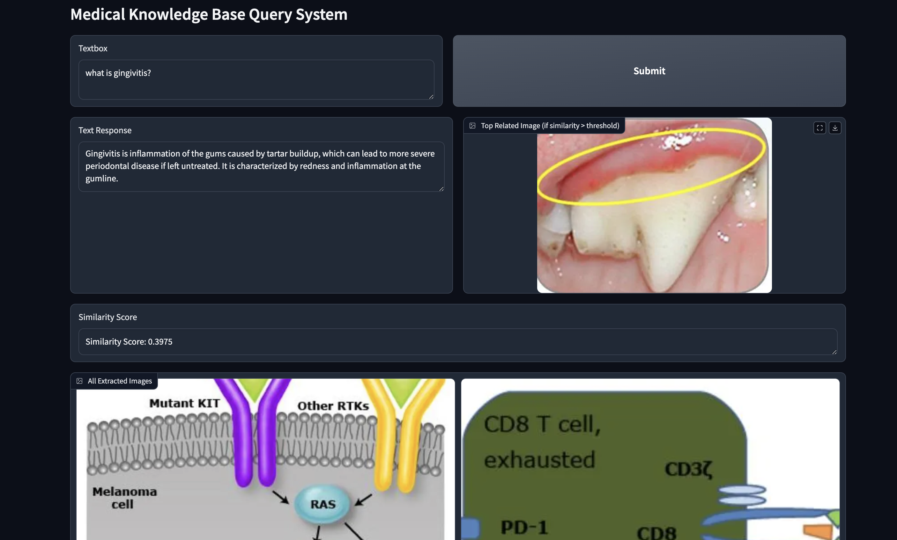
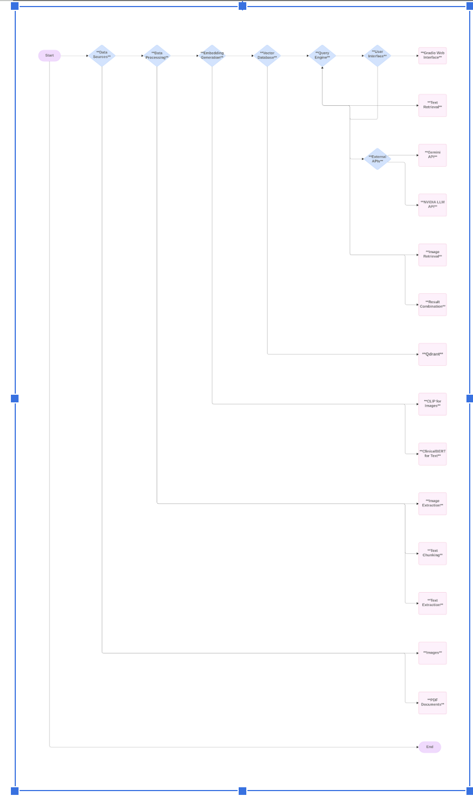

# Advancing Text Searching with Advanced Indexing Techniques in Healthcare Applications(In Progress)

Welcome to the project repository for advancing text searching with advanced indexing techniques in healthcare applications. This project implements a powerful Retrieval-Augmented Generation (RAG) system using cutting-edge AI technologies, specifically designed to enhance text searching capabilities within the healthcare domain.I have also implemented Multimodal Text Searching for Medical Documents.

## 🚀 Features For Text Based Medical Query Based System

- **BioLLM 8B**: Advanced language model for generating and processing medical text.
- **ClinicalBert**: State-of-the-art embedding model for accurate representation of medical texts.
- **Qdrant**: Self-hosted Vector Database (Vector DB) for efficient storage and retrieval of embeddings.
- **Langchain & Llama CPP**: Orchestration frameworks for seamless integration and workflow management.

# Medical Knowledge Base Query System

A multimodal medical information retrieval system combining text and image-based querying for comprehensive medical knowledge access.

## Features For Multimodality Medical Query Based System:


[Watch the video on YouTube](https://youtu.be/pNy7RqfRUrc?si=1HQgq54oHT6YoR0B)

### 🧠 Multimodal Medical Information Retrieval
- Combines text and image-based querying for comprehensive medical knowledge access
- Uses Qdrant vector database to store and retrieve both text and image embeddings

### 🔤 Advanced Natural Language Processing
- Utilizes ClinicalBERT for domain-specific text embeddings
- Implements NVIDIA's Palmyra-med-70b model for medical language understanding

### 🖼️ Image Analysis Capabilities
- Incorporates CLIP (Contrastive Language-Image Pre-training) for image feature extraction
- Generates image summaries using Google's Gemini 1.5 Flash model

### 📄 PDF Processing
- Extracts text and images from medical PDF documents
- Implements intelligent chunking strategies for text processing

### 🔍 Vector Search
- Uses Qdrant for efficient similarity search on both text and image vectors
- Implements hybrid search combining CLIP-based image similarity and text-based summary similarity

### 🖥️ Interactive User Interface
- Gradio-based web interface for easy querying and result visualization
- Displays relevant text responses alongside related medical images

### 🧩 Extensible Architecture
- Modular design allowing for easy integration of new models or data sources
- Supports both local and cloud-based model deployment 
The high level architectural framework for this application is given as follows:


### ⚡ Performance Optimization
- Implements batching and multi-threading for efficient processing of large document sets
- Utilizes GPU acceleration where available

### 🎛️ Customizable Retrieval
- Adjustable similarity thresholds for image retrieval
- Configurable number of top-k results for both text and image queries

### 📊 Comprehensive Visualization
- Displays query results with both textual information and related images
- Provides a gallery view of all extracted images from the knowledge base

### 🔐 Environment Management
- Uses .env file for secure API key management
- Supports both CPU and GPU environments


## 🎥 Video Demonstration

Explore the capabilities of our project with our detailed [YouTube video](https://youtu.be/nKCKUcnQ390).

## Installation

To get started with this project, follow these steps:

1. **Install Dependencies**:
   ```bash
   pip install -r requirements.txt
   ```

2. **Set up Qdrant**:
   - Follow the [Qdrant Installation Guide](https://qdrant.tech/documentation/quick_start/) to install and configure Qdrant.

3. **Configure the Application**:
   - Ensure configuration files for BioLLM, ClinicalBert, Langchain, and Llama CPP are correctly set up.

4. **Run the Application**:
   ```bash
   uvicorn app:app
   ```

## 💡 Usage

- **Querying the System**: Input medical queries via the application's interface for detailed information retrieval.
- **Text Generation**: Utilize BioLLM 8B to generate comprehensive medical responses.

## 👥 Contributing

We welcome contributions to enhance this project! Here's how you can contribute:

1. Fork the repository.
2. Create a new branch (`git checkout -b feature-name`).
3. Commit your changes (`git commit -am 'Add feature'`).
4. Push to the branch (`git push origin feature-name`).
5. Open a Pull Request with detailed information about your changes.

## 📜 License

This project is licensed under the MIT License. See the [LICENSE](LICENSE) file for details.

## 📞 Contact

For questions or suggestions, please open an issue or contact the repository owner at [surbhisharma9099@gmail.com](mailto:surbhisharma9099@gmail.com).
